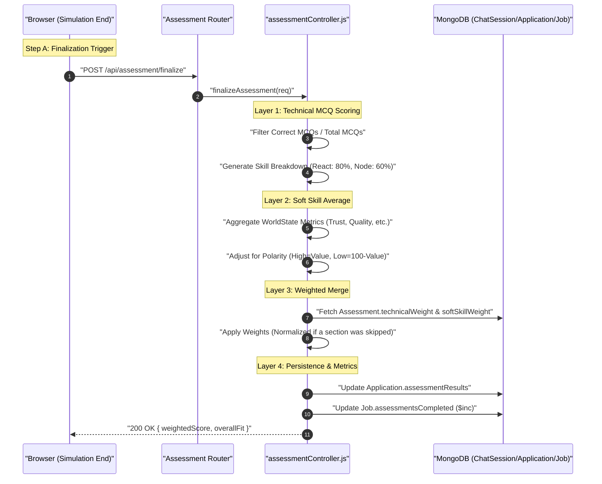

# HR Flow 8: Weighted Final Score Calculation (Ultra-Granular)

This flow explains the mathematical "Grand Synthesis" where MCQ scores and Scenario metrics are merged into a single hiring priority score.

---

## 1. The Visual Flow: The Grading Pipeline


---

## 2. Technical Layer Breakdown

### Layer 1: The MCQ Technical Score
- **Logic**: (Line 593) Iterates through `session.mcqAnswers`.
- **Skill Breakdown Mapper**: (Line 601) Groups answers by skill and calculates a percentage per bucket. This powers the "Radar Chart" visual in the HR report.
- **Base Score**: `(correct / total) * 100`.

### Layer 2: The Scenario Soft Skill Score
- **Logic**: (Line 612) Reads the final `worldState` from the chat session.
- **Polarity Adjustment**: (Line 619) If a metric like "Risk" is configured as "Low Polarity", the system calculates `100 - value` (e.g., 20% Risk = 80% Health).
- **Base Score**: The arithmetic mean of all active metric health scores.

### Layer 3: Dynamic Weight Normalization
- **Feature**: [assessmentController.js](file:///home/alisha.shaik/Desktop/projects/jobs/JodsScreening/backend/controllers/assessmentController.js) (Line 627)
- **Constraint Handling**: If a recruiter disables the Technical phase for a specific candidate, the system **auto-redistributes** 100% of the weight to the Behavioral phase (and vice versa) so the final score is always out of 100.
  ```javascript
  if (hasTech && hasSoft) {
      weightedScore = (tech * weightT) + (soft * weightS);
  } else if (hasTech) {
      weightedScore = tech; // 100% weight to Tech
  }
  ```

### Layer 4: Qualitative Fit Mapping
- **Thresholds**: (Line 642)
  - `High Potential`: >= 85%
  - `Strong Fit`: >= 70%
  - `Moderate Fit`: >= 50%
  - `Low Fit`: < 50%

### Layer 5: Job-Level Aggregation
- **Side Effect**: (Line 678) The system performs an atomic `$inc` on `assessmentsCompleted` in the `Job` document. This is what drives the "Completion Rate" progress bar on the HR Dashboard.

---

## 3. Data Transformation Summary
| Component | Input | Transformation | Output Score |
| :--- | :--- | :--- | :--- |
| **Technical** | `mcqAnswers[]` | Correctness Ratio | `technicalScore` (0-100) |
| **Behavioral** | `worldState{}` | Polarity-Adjusted Mean | `softSkillScore` (0-100) |
| **Symmetry** | `assessmentConfig` | Auto-Weight Redistribution | `weightedScore` (0-100) |
| **Labeling** | `weightedScore` | Tiered If/Else Switch | `overallFit` (Label) |
