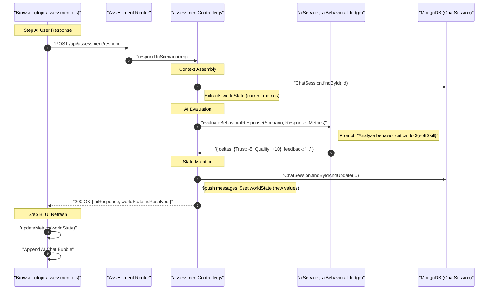

# HR Flow 7: Behavioral Scenarios & AI Scoring (Ultra-Granular)

This flow explains the most complex part of the simulation: The dynamic "AI Judge" that evaluates candidate behavior in real-time.

---

## 1. The Visual Flow: The "AI Judge" Loop


---

## 2. Technical Layer Breakdown

### Layer 1: The UI (Socket-like REST Updates)
- **Source**: [dojo-assessment.ejs](file:///home/alisha.shaik/Desktop/projects/jobs/JodsScreening/frontend/views/dojo-assessment.ejs)
- **Dynamic Interaction**: (Line 314) `submitScenarioResponse()` handles the free-text input and performs a local DOM update (Line 337) to append the AI response without a full page reload, creating a "chat-like" experience.
- **Metric Visualization**: (Line 388) `updateMetrics()` re-renders the stats bar in the header synchronously with every turn.

### Layer 2: The Orchestrator (Metric Delta Application)
- **Controller**: [assessmentController.js](file:///home/alisha.shaik/Desktop/projects/jobs/JodsScreening/backend/controllers/assessmentController.js)
- **Function**: `respondToScenario` (Line 409).
- **Core Logic**:
  - **Metric Clipping**: (Line 446) Ensures metrics stay within the 0-100% range:
    ```javascript
    Math.max(0, Math.min(100, currentVal + Number(delta)))
    ```
  - **Skill Accumulation**: (Line 452) If a delta is positive, it increments the global `skillScores` Map under the "Behavioral" category, contributing to the final match score.

### Layer 3: The Brain (The Behavioral Judge)
- **Service**: [aiService.js](file:///home/alisha.shaik/Desktop/projects/jobs/JodsScreening/backend/services/aiService.js)
- **Logic**: (Line 526) Uses a specialized system prompt that instructs the AI to be a **Behavioral Judge**.
- **The Evaluation Constraint**: (Line 549) The AI is strictly limited to a JSON response schema containing `deltas`, `feedback`, and `justification`.
- **Critical Grading**: (Line 559) The prompt enforces scoring rules (e.g., "Only give +10 for exceptional responses").

### Layer 4: Transition Trigger (Turn Logic)
- **Constraint**: Each scenario is hardcoded to a **3-turn limit** in [assessmentController.js](file:///home/alisha.shaik/Desktop/projects/jobs/JodsScreening/backend/controllers/assessmentController.js) (Line 491).
- **Completion Logic**:
  - `isScenarioOver`: (messages.length / 2) >= 3.
  - `isLastScenario`: currentScenario >= totalScenarios.

---

## 3. Data Transformation Summary
The Simulation transforms **Natural Language** into **Numeric Sentiment**:
| Component | Input | Logic | Output Data |
| :--- | :--- | :--- | :--- |
| **User Input** | Text String | LLM Sentiment Analysis | Numeric Deltas (-15 to +15) |
| **World State** | Previous % | `prev + delta` | Current Metric % |
| **Feedback** | `justification` | AI-generated reasoning | `aiResponseText` |
| **Final Logic** | 3 Turns reached | Status = 'resolved' | Transition Event |
