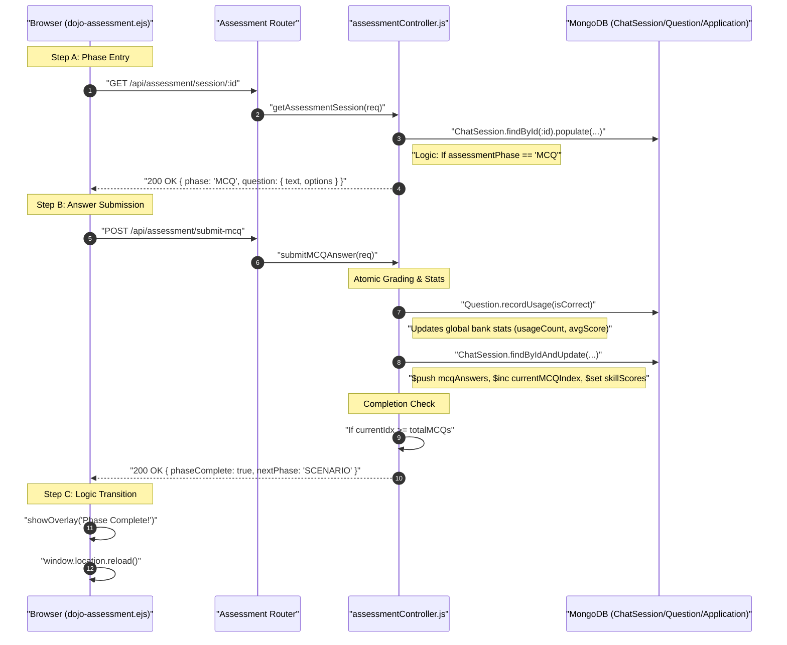

# HR Flow 6: Assessment Simulation - MCQ Phase (Ultra-Granular)

This flow explains the technical execution of Phase 1 of the candidate evaluation: The Technical Multiple Choice Questions.

---

## 1. The Visual Flow: MCQ State Machine


---

## 2. Technical Layer Breakdown

### Layer 1: The UI (Reactive Assessment Engine)
- **Source**: [dojo-assessment.ejs](file:///home/alisha.shaik/Desktop/projects/jobs/JodsScreening/frontend/views/dojo-assessment.ejs)
- **State Switcher**: (Line 153) `loadState()` is the primary orchestrator. It fetches the session and determines which interface to render based on `data.phase`.
- **Render Logic**: `renderMCQ()` (Line 174) constructs the options grid and binds the `submitMCQ(idx)` click handler.

### Layer 2: The Proctor (Backend State Control)
- **Controller**: [assessmentController.js](file:///home/alisha.shaik/Desktop/projects/jobs/JodsScreening/backend/controllers/assessmentController.js)
- **Function**: `getAssessmentSession` (Line 146).
- **Granular Filtering**: (Line 167) The system only fetches questions where `status === 'active'`. This ensures a candidate never sees a question that HR is currently editing or has disabled.

### Layer 3: Atomic Scoring & Skill Mapping
- **Function**: `submitMCQAnswer` (Line 276).
- **Skill Sanity**: (Line 320) Uses `sanitizeSkill()` to replace dots with Unicode Fullwidth dots (．), preventing Mongoose from throwing a "Map key cannot contain dots" error.
- **Score Injection**: (Line 345) Updates the `skillScores` Map using dynamic key interpolation:
  ```javascript
  $set: { [`skillScores.${skillKey}`]: currentScore + (isCorrect ? 10 : 0) }
  ```

### Layer 4: Global Bank Feedback Loop
- **Impact**: Every answer submitted by a candidate is fed back into the `Question` model (Line 317).
- **Calculation**: `Question.recordUsage(isCorrect)` updates the `difficultyIndex` and `avgScore` of that question across ALL jobs in the platform, helping HR identify "too easy" or "too hard" questions in the global bank.

---

## 3. Data Transformation Summary
The MCQ Phase transforms **Binary Choices** into **Skill Distributions**:
| Input | Logic | Output Data |
| :--- | :--- | :--- |
| `idx` (Option Index) | `isCorrect = (idx === correctIdx)` | `mcqAnswers` Array |
| `isCorrect` | `score += 10` | `skillScores` Map (e.g., Node.js: 40) |
| `answerCount` | `index++` | `currentMCQIndex` |
| `index >= count` | `phase = 'SCENARIO'` | Phase Transition Trigger |
