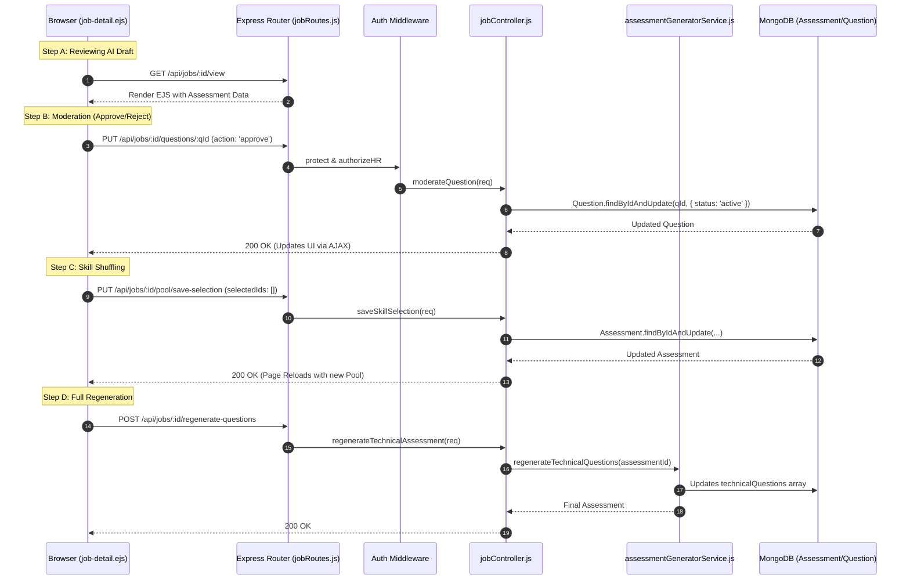

# HR Flow 2: Assessment Moderation & Tuning (Ultra-Granular)

After a job is created, the system generates a draft assessment. This flow covers how HR reviews, edits, and finalizes that assessment before it goes live.

---

## 1. The Visual Flow: Moderation Cycle

---

## 2. Technical Layer Breakdown

### Layer 1: The UI (Moderation Board)
- **Source**: [job-detail.ejs](file:///home/alisha.shaik/Desktop/projects/jobs/JodsScreening/frontend/views/job-detail.ejs)
- **Component**: The **Assessment Builder** tab (Line 358).
- **Frontend Logic**: 
  - `moderateQuestion()` (Line 826) handles individual Approvals. It uses AJAX to avoid page jumps.
  - `enforceLimits()` (Line 931) ensures HR doesn't select more questions than configured (e.g., 3 per skill).

### Layer 2: The Moderation Logic
- **Controller**: [jobController.js](file:///home/alisha.shaik/Desktop/projects/jobs/JodsScreening/backend/controllers/jobController.js)
- **Function**: `moderateQuestion` (Line 287).
- **Core Logic**:
  1. It first determines the action: `approve` or `reject`.
  2. **If Approve**: It promotes the question to `isVerified: true` and `status: 'active'`, making it available in the Global Bank for other jobs.
  3. **If Reject**: It removes the question from the current `Assessment` and sets the `Question` status to `retired`.
  4. **Status Update**: It checks if there are any `suggestedQuestions` left. If not, it moves the assessment status from `pending_review` to `active` (Line 354).

### Layer 3: Regneration & Tuning
- **Routes**:
  - `regenerate-questions` (Line 27 in `jobRoutes.js`)
  - `regenerate-scenarios` (Line 28)
- **Service Orchestration**:
  - `assessmentGeneratorService.js` (Line 279) handles **Technical Regeneration**. It pulls new questions from the bank *excluding* the ones already in the assessment to ensure variation (Line 312).
  - `assessmentGeneratorService.js` (Line 147) handles **Scenario Regeneration**. It calls the AI JD Parser to rebuild the soft-skill metrics and templates (Line 173).

### Layer 4: Persistence Changes
| Entity | Change during Moderation | Trigger |
| :--- | :--- | :--- |
| **Question** | `status` moves to `active` or `retired` | `moderateQuestion` |
| **Assessment** | `technicalQuestions` array is updated | `saveSkillSelection` |
| **Assessment** | `status` moves to `active` | Final question approved |
| **AuditLog** | New entry with `action: 'moderate_question'` | `moderateQuestion` |

---

## 3. The "State Loop"
1. HR enters the view. Assessment is `pending_review`.
2. HR approves/shuffles. `suggestedQuestions` array shrinks.
3. Once `suggestedQuestions` is empty, the Assessment is marked `active`.
4. HR can still "Refresh" or "Regenerate" at any time, which moves it back to `pending_review` if new AI suggestions are created.
