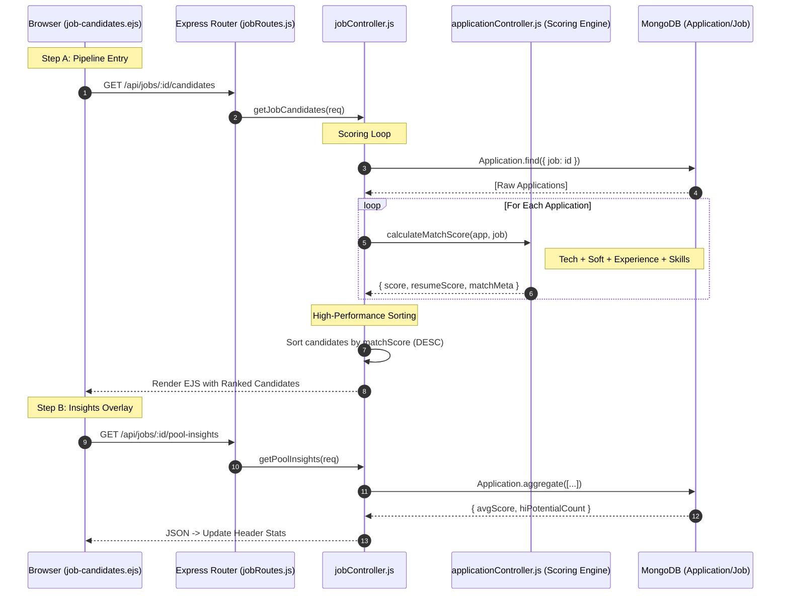

# HR Flow 3: Candidate Pipeline & Scoring Logic (Ultra-Granular)

This flow explains how candidates are ranked, scored, and visualized in the HR Leaderboard.

---

## 1. The Visual Flow: Ranking Architecture

---

## 2. Technical Layer Breakdown

### Layer 1: The UI (The Leaderboard)
- **Source**: [job-candidates.ejs](file:///home/alisha.shaik/Desktop/projects/jobs/JodsScreening/frontend/views/job-candidates.ejs)
- **Architecture**: **Dual-Pool Strategy** (Line 265).
  - **Qualified Pool**: Candidates who COMPLETED the simulation. Ranked by `weightedScore` (Tech + Soft).
  - **Initial Pool**: New applicants. Ranked by `resumeScore` (Experience + AI Skill Match).
- **Dynamic Metrics**: The header stats (Line 240) are populated via a post-load AJAX call to `/pool-insights`.

### Layer 2: The Scoring Engine (The "Secret Sauce")
- **File**: [applicationController.js](file:///home/alisha.shaik/Desktop/projects/jobs/JodsScreening/backend/controllers/applicationController.js)
- **Function**: `calculateMatchScore` (Line 21).
- **Granular Algorithm**:
  1. **Standardized Weights**: Fetches `rankingWeights` from the Job doc (Line 24). Default: Tech (40%), Soft (35%), Exp (15%), Skills (10%).
  2. **Experience Normalization**: (Line 45)
     - If inside [min, max]: 100%.
     - If > max: 100% (Overqualified).
     - If < min: (actual/min) * 80% (Underqualified penalty).
  3. **Resume Skill Match**: (Line 57) AI-parsed skill overlap from `application.skillsMatch.score`.
  4. **Dynamic Re-weighting**: (Line 74) If a specific assessment section was skipped, the algorithm redistributes that weight across active sections to maintain a 100% scale.

### Layer 3: Batch Ranking
- **File**: [jobController.js](file:///home/alisha.shaik/Desktop/projects/jobs/JodsScreening/backend/controllers/jobController.js)
- **Logic**: (Line 964) The controller maps the scoring function over the entire array of applications and performs a JavaScript `sort()` before sending data to the frontend.

### Layer 4: Data Layer (Aggregation)
- **Route**: `GET /api/jobs/:id/pool-insights`
- **Logic**: uses MongoDB Aggregation `$group` (Line 993) to calculate:
  - `avgTechScore`
  - `avgSoftScore`
  - `highPotentialCount` (Candidates with score > 80).

---

## 3. Data Transformation Summary
| Component | Input | Transformation | Output Score |
| :--- | :--- | :--- | :--- |
| **Experience** | `yearsExperience` | Gaussian-like filter against min/max | 0 - 100 |
| **Skill Match** | `extractedSkills` | Semantic overlap with Job Skills | 0 - 100 |
| **Assessment** | `assessmentResults` | AI-graded simulation performance | 0 - 100 |
| **Final Pipe** | All of above | Weighted Average Sum | **Match Score (%)** |
