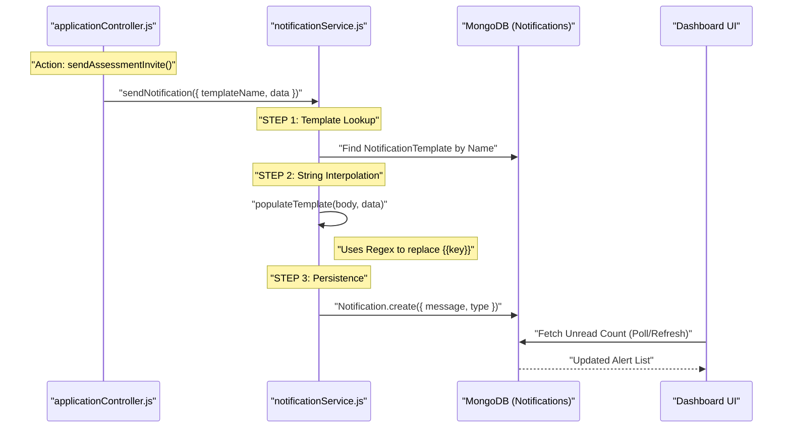
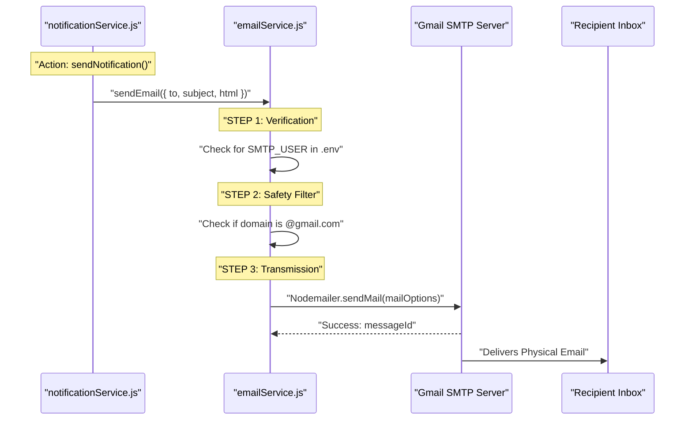
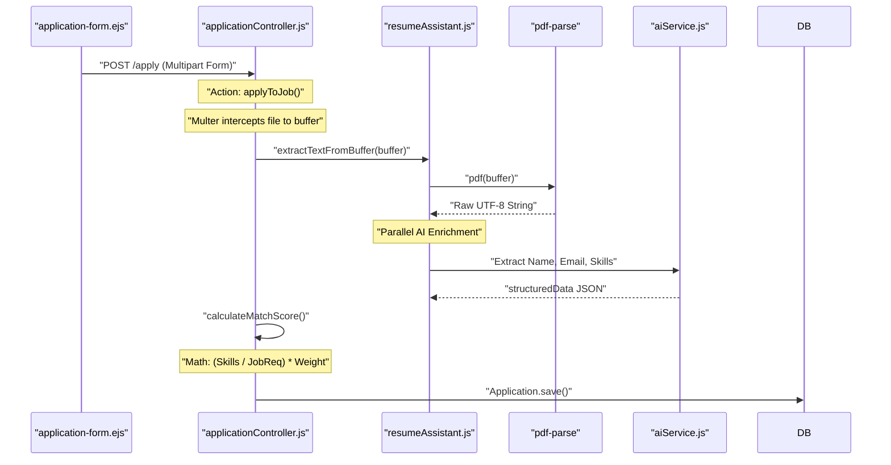
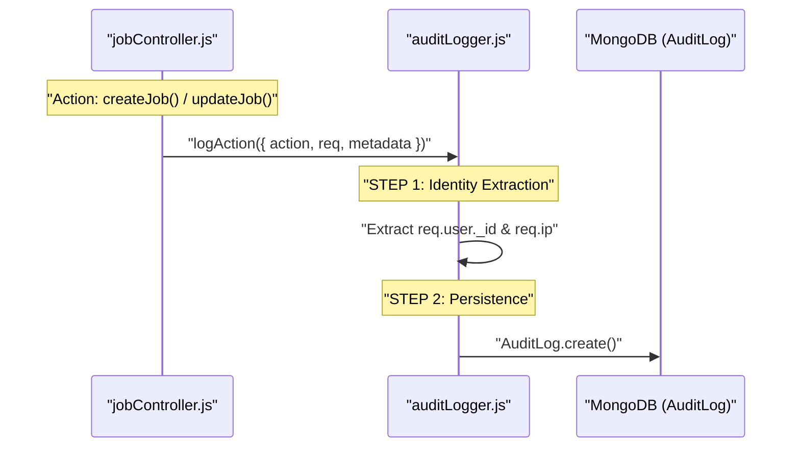
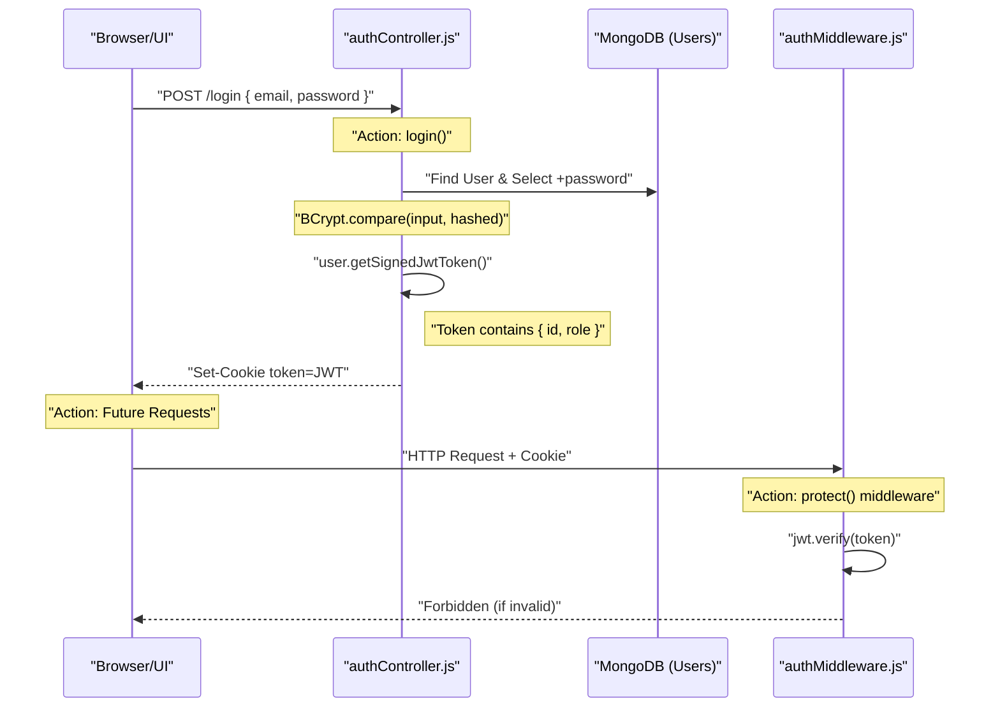
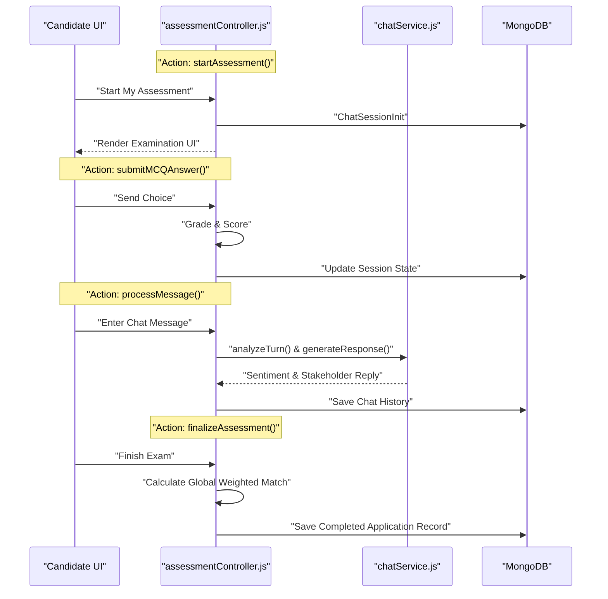

# Microscopic System Flows

This document provides a low-level, file-to-file view of how the most critical services in ScenarioSim operate. Use these as a map for debugging or extending features.

---

## 1. Notification Flow (In-App)
Handles the creation and delivery of real-time alerts inside the HR and Candidate dashboards.

### 🎬 Sequence Diagram

### 🔬 Files & Actions
- **Controller Action**: `applicationController.js` -> `inviteCandidate()`
- **Controller Action**: `assessmentController.js` -> `finalizeAssessment()` (once completed)
- **Service**: `backend/services/notificationService.js` -> `sendNotification()`
- **Model**: `backend/models/Notification.js`

---

## 2. Email Dispatch Flow
The standalone engine for sending external communications via SMTP.

### 🎬 Sequence Diagram

### 🔬 Files & Actions
- **Trigger Service**: `backend/services/notificationService.js`
- **Auth Trigger**: `backend/controllers/authController.js` -> `register()`
- **Service**: `backend/services/emailService.js` -> `sendEmail()`
- **Config**: `backend/.env` (`SMTP_USER`, `SMTP_PASS`)

---

## 3. Resume Parsing & Application Flow
How a raw applicant becomes a scoped candidate with a profile.

### 🎬 Sequence Diagram

### 🔬 Files & Actions
- **Controller Action**: `applicationController.js` -> `applyToJob()`
- **Service**: `backend/services/resumeAssistant.js` -> `extractTextFromBuffer()`
- **Analysis**: `backend/services/aiService.js` (Groq/OpenAI Integration)

---

## 4. Audit Logging (System History)
Every critical action leaves a permanent trail here.

### 🎬 Sequence Diagram

### 🔬 Files & Actions
- **Controller Action**: `applicationController.js` -> `applyToJob()` (Logs 'create')
- **Controller Action**: `jobController.js` -> `createJob()` / `updateJob()`
- **Utility**: `backend/utils/auditLogger.js` -> `logAction()`
- **Model**: `backend/models/AuditLog.js`

---

## 5. Global Leaderboard & Scoring
The mathematical engine behind candidate rankings.

### 🎬 Logic Map
*   **Base Score**: (Years Experience / Min Required) * 100 [Capped at 100]
*   **Skill Match**: (Resume Skills ∩ Job Skills) / Total Required * 100
*   **Final Aggregate**: `(Exp * 0.15) + (Skills * 0.10) + (Tech * 0.40) + (Soft * 0.35)`

### 🔬 Files & Actions
- **Controller Action**: `applicationController.js` -> `getJobCandidates()` (Fetches and sorts by score)
- **Math Logic**: `backend/controllers/applicationController.js` -> `calculateMatchScore()`
- **Weights**: `Job` model -> `rankingWeights` (Configurable by HR)

---

## 6. Authentication & JWT Safety
How the system identifies you across sessions.

### 🎬 Sequence Diagram

### 🔬 Files & Actions
- **Controller Action**: `authController.js` -> `login()`
- **Controller Action**: `authController.js` -> `register()`
- **Middleware**: `backend/middleware/auth.js` -> `protect()`
- **Model**: `backend/models/User.js` (`matchPassword`, `getSignedJwtToken`)

---

## 7. Assessment Simulation (Dojo) Flow
The real-time candidate experience.

### 🎬 Sequence Diagram

### 🔬 Files & Actions
- **Controller**: `backend/controllers/assessmentController.js`
- **Service**: `backend/services/chatService.js` (Roleplay & Analysis)
- **Model**: `backend/models/ChatSession.js`
