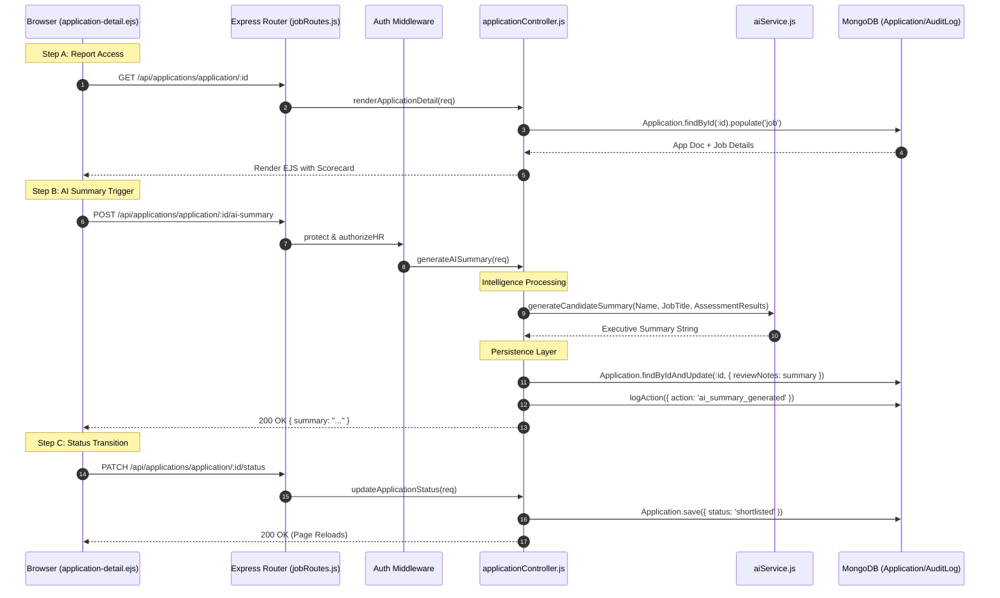

# HR Flow 4: Application Review & AI Executive Summary (Ultra-Granular)

This flow details how HR reviews an individual candidate, triggers AI performance analysis, and takes action (Schedule/Invite/Reject).

---

## 1. The Visual Flow: Individual Report & AI Logic


---

## 2. Technical Layer Breakdown

### Layer 1: The UI (Executive Scorecard)
- **Source**: [application-detail.ejs](file:///home/alisha.shaik/Desktop/projects/jobs/JodsScreening/frontend/views/application-detail.ejs)
- **Data Points Visible**:
  - **Match Index**: The `matchScore` recalculation happening in real-time (Line 299).
  - **Skill Overlap**: Visualizing `skillsMatch` from the resume parser (Line 135).
  - **Screening**: Comparison of `screeningAnswers` against expected results (Line 161).

### Layer 2: The Action Logic (Status Machine)
- **Controller**: [applicationController.js](file:///home/alisha.shaik/Desktop/projects/jobs/JodsScreening/backend/controllers/applicationController.js)
- **Function**: `updateApplicationStatus` (Line 584).
- **Core Transitions**:
  - **Shortlisted**: Updates `shortlistedAt` timestamp (Line 605).
  - **Rejected**: Updates `rejectedAt` (Line 606).
  - **Interview Scheduled**: Requires `interviewDate`. Triggers a special notification with the calendar details (Line 652).

### Layer 3: AI Executive Summary
- **Controller**: `generateAISummary` (Line 679).
- **Service**: [aiService.js](file:///home/alisha.shaik/Desktop/projects/jobs/JodsScreening/backend/services/aiService.js) (Line 478).
- **Prompt Construction**:
  ```javascript
  `Generate a professional executive summary... 
   Focus on technical proficiency and soft skills fit based on: ${resultsJson}`
  ```
- **Side Effect**: The generated text is permanently saved in the `reviewNotes` field of the `Application` document (Line 696).

### Layer 4: Change Log (Auditability)
| Field Updated | Value | Controller Trigger |
| :--- | :--- | :--- |
| `status` | 'shortlisted' / 'rejected' | `updateStatus()` |
| `reviewNotes` | "Candidate is a strong technical lead..." | `generateAISummary()` |
| `interviewDate` | ISO Date String | `scheduleInterview()` |
| `reviewedBy` | `req.user._id` | Every action |

---

## 3. Data Transformation Summary
The Individual Report is the **Synthesis Layer**. It takes data from:
1. **Resume Parser**: To populate technical skills.
2. **Simulation Service**: To populate Tech/Soft scores.
3. **HTTP Body**: To populate screening answers.
4. **AI Service**: To transform numbers into a readable executive summary.
