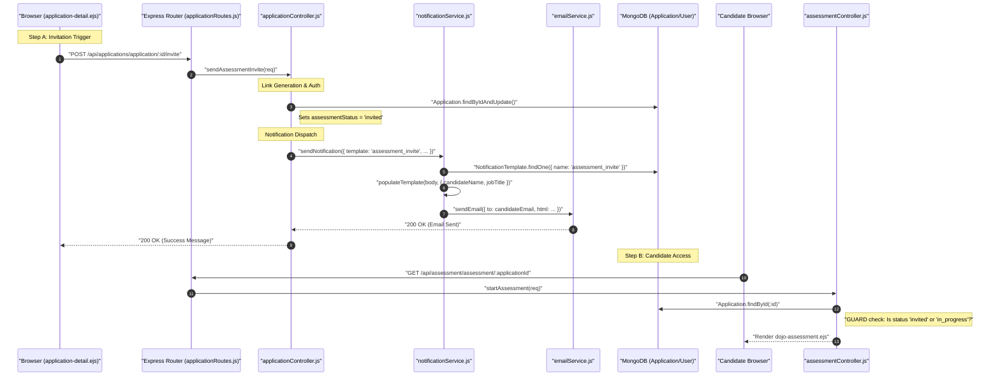

# HR Flow 5: Assessment Invitation & Link Generation (Ultra-Granular)

This flow explains how HR triggers an invitation and how the system generates a secure, candidate-specific link to the Scenario Simulation.

---

## 1. The Visual Flow: From Dashboard to Simulation


---

## 2. Technical Layer Breakdown

### Layer 1: The Invitation Payload
- **Source Component**: [application-detail.ejs](file:///home/alisha.shaik/Desktop/projects/jobs/JodsScreening/frontend/views/application-detail.ejs)
- **Frontend Function**: `sendInvite()` (Line 561).
- **Hardcoded Config**: The payload includes a `config` object (Strategy: 'balanced', Difficulty: 'Match Job') which dictates AI behavior for that specific candidate (Line 565).

### Layer 2: The Logic Gate (Middleware & Guards)
- **Controller**: [applicationController.js](file:///home/alisha.shaik/Desktop/projects/jobs/JodsScreening/backend/controllers/applicationController.js)
- **Function**: `sendAssessmentInvite` (Line 718).
- **Validation**: 
  - Checks if `job.requireAssessment` is true.
  - Checks if the candidate has already completed an assessment.
- **Persistence**: Updates `application.assessmentStatus` to `'invited'` and `application.status` to `'invited_for_assessment'`.

### Layer 3: The Link & Invitation Delivery
- **Service**: [notificationService.js](file:///home/alisha.shaik/Desktop/projects/jobs/JodsScreening/backend/services/notificationService.js)
- **Function**: `sendNotification` (Line 24).
- **The Magic Link**: (Line 90) The email template dynamically constructs the URL:
  ```javascript
  `${process.env.APP_URL}/api/assessment/assessment/${application._id}`
  ```
- **Security Logic**: Access to this URL is protected by the `protect` middleware in [assessmentRoutes.js](file:///home/alisha.shaik/Desktop/projects/jobs/JodsScreening/backend/routes/assessmentRoutes.js) (Line 7). The user MUST be logged in as the specific candidate tied to that `applicationId`.

### Layer 4: The Simulation Gatekeeper
- **Controller**: [assessmentController.js](file:///home/alisha.shaik/Desktop/projects/jobs/JodsScreening/backend/controllers/assessmentController.js)
- **Function**: `startAssessment` (Line 21).
- **Low-Level Guard**: (Line 36)
  ```javascript
  const allowedStatuses = ['invited', 'in_progress'];
  if (!allowedStatuses.includes(application.assessmentStatus)) {
      return res.status(403).send('Link invalid or assessment complete.');
  }
  ```
- **Session Initialization**: If the candidate is clicking the link for the first time, the `ChatSession` is created here (Line 68).

---

## 3. Data Transformation Summary
| Step | Field | Logic |
| :--- | :--- | :--- |
| **Trigger** | `assessmentStatus` | `'pending'` -> `'invited'` |
| **Delivery** | `emailBody` | Replaced `{{candidateName}}` with User Obj property |
| **Access** | `req.user._id` | Validated against `application.candidate` |
| **Start** | `assessmentPhase` | Initialized based on `application.assessmentConfig` |
