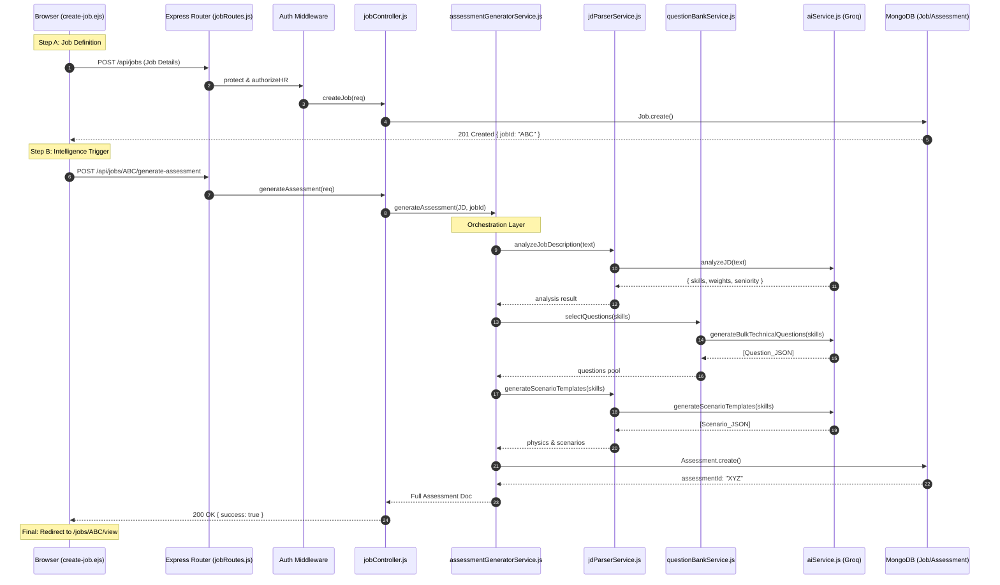

# The Grand Recruitment Flow (Ultra-Granular Architecture)

This document provides a 360-degree technical view of how a job starts as a form and ends as a fully-baked AI Assessment.

---

## 1. The Visual Master-Map

---

## 2. Technical Layer Breakdown

### Layer 1: The UI (Frontend)
- **Source**: [create-job.ejs](file:///home/alisha.shaik/Desktop/projects/jobs/JodsScreening/frontend/views/create-job.ejs)
- **Logic**: The script at the bottom (Line 514) uses a **Sequential Chaining** strategy.
    1. It first creates the Job record.
    2. Then it uses the new Job ID to call the "Assessment Generator" endpoint.
    3. It shows a **Loading Overlay** (Line 432) while the AI is thinking.

### Layer 2: Routing & Protection
- **Router**: [jobRoutes.js](file:///home/alisha.shaik/Desktop/projects/jobs/JodsScreening/backend/routes/jobRoutes.js)
- **Protection**: Every request passes through `protect` and `authorizeHR` (Lines 7-8). If the JWT is expired or the user is just a 'candidate', the flow stops at Line 17 of `authMiddleware.js`.

### Layer 3: The Job Controller
- **File**: [jobController.js](file:///home/alisha.shaik/Desktop/projects/jobs/JodsScreening/backend/controllers/jobController.js)
- **Action**: `createJob` (Line 18) handles the initial DB write.
- **Action**: `generateAssessment` (Line 92) acts as the bridge between HTTP and the Assessment Service.

### Layer 4: Orchestration (The "Brain")
- **File**: [assessmentGeneratorService.js](file:///home/alisha.shaik/Desktop/projects/jobs/JodsScreening/backend/services/assessmentGeneratorService.js)
- **Function**: `generateAssessment` (Line 25).
- **Process**:
    1. **JD Analysis**: Calls `analyzeJobDescription` (Line 30) to understand what the role actually is.
    2. **Strategy Application**: Applies `technical`, `behavioral`, or `balanced` weighting based on HR's input (Line 33).
    3. **Technical Selection**: Calls `selectQuestions` (Line 69) which either pulls from the DB bank or generates new ones via AI.
    4. **Scenario Creation**: Calls `generateScenarioTemplates` (Line 94) to create situational-judgment questions.

### Layer 5: Data & AI
- **AI Engine**: [aiService.js](file:///home/alisha.shaik/Desktop/projects/jobs/JodsScreening/backend/services/aiService.js) (Our new lean version).
- **Models Used**: Llama 3.3 70b (via Groq).
- **Final Result**: The `Assessment` document is created with a `status` of either `active` or `pending_review` (Line 132) depending on if the AI questions need HR moderation.

---

## 3. Data Flow Summary
| Action | Input Data | Output Data | State Change |
| :-- | :-- | :-- | :-- |
| **Post Job** | Form (JSON) | Job Document | New record in `jobs` collection |
| **Parsing** | Job Description (Text) | Skill Map (JSON) | No persistent change |
| **Question Gen** | Skill List | MCQs (JSON) | New records in `questions` bank |
| **Assessment Gen** | Questions + Scenarios | Assessment Doc | Link established: `job.assessmentId = id` |
