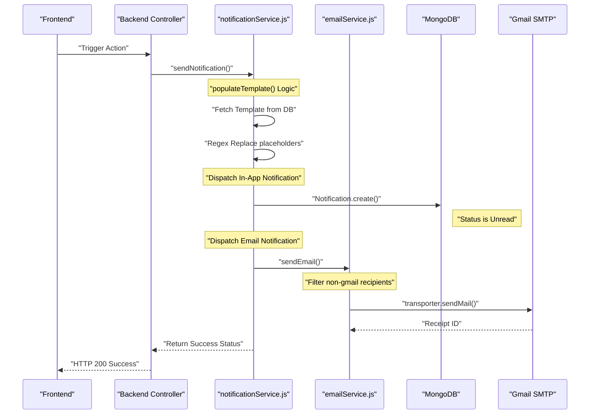
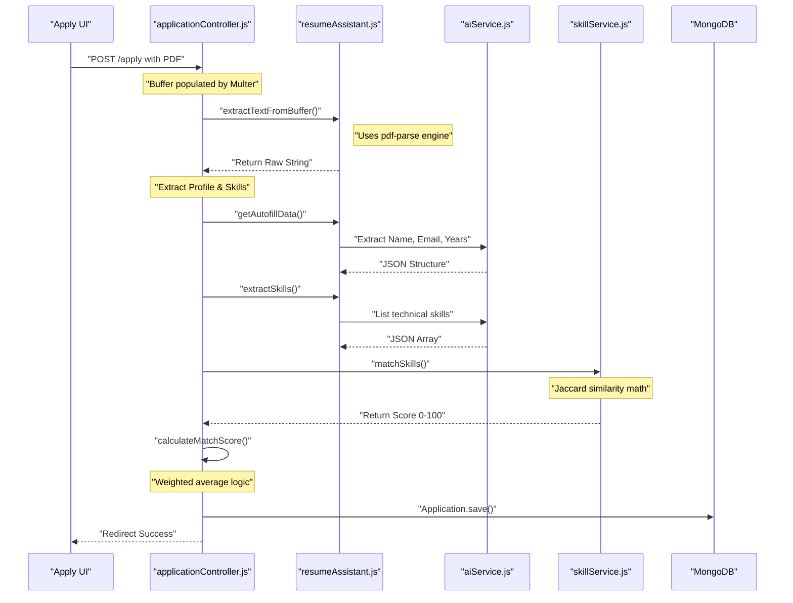
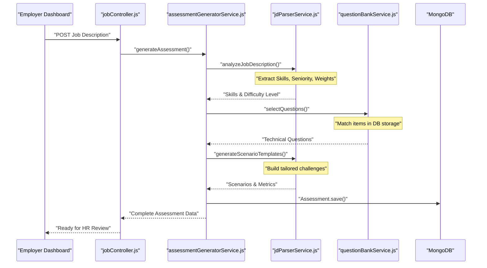
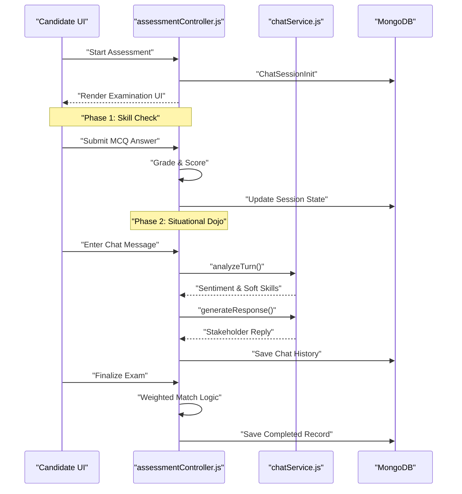

# Microscopic System Flows

This document provides a low-level, file-to-file view of how the most critical services in ScenarioSim operate.

---

## 1. Notification & Email Flow
This flow is triggered whenever the system needs to alert a user (e.g., Job Applied, Assessment Completed, Interview Scheduled).

### 🎬 Sequence Diagram

### 🔬 Low-Level Detail
*   **Entry Point**: `notificationService.js` -> `sendNotification()`
*   **Template Engine**: A custom `populateTemplate` function uses `new RegExp('{{' + key + '}}', 'g')` to perform global string replacement.
*   **Auto-Policy**: If a template belongs to the `CANDIDATE` category, `settings.sendEmail` is forced to `true` to ensure candidates always get proof of their actions.

---

## 2. PDF Parsing & Resume Matching Flow
This is the "Brain" of the application process. It turns a raw PDF into structured scores.

### 🎬 Sequence Diagram

### 🔬 Low-Level Detail
*   **The pdf() method**: We use the `pdf-parse` library. It reads the binary buffer and traverses the PDF’s internal "Page" objects to find text streams.
*   **AI Extraction Strategy**: Instead of naive regex, we use "Prompt Engineering" to ask for specifically formatted JSON structures.
*   **Fallback**: If the AI (Groq/OpenAI) fails, it switches to `_keywordFallback()` which uses regex to scan for a hardcoded list of common tech keywords.

---

## 3. AI Question Suggestion Flow
How the system analyzes a JD to build a custom exam.

### 🎬 Sequence Diagram

---

## 4. Assessment Simulation (Dojo) Flow
The real-time candidate experience.

### 🎬 Sequence Diagram

---

## 5. Key Inbuilt Methods Used

| Method | Source | Purpose |
| :--- | :--- | :--- |
| `Buffer.from()` | Node.js Core | Converts binary file data into a format Node can manipulate. |
| `pdf(buffer)` | `pdf-parse` | The main engine that reads the PDF structure and returns serialized text. |
| `Object.entries()`| ES6/JS | Converts the data object into an array for looping. |
| `populate()` | Mongoose | Automatically joins two collections. |
| `bcrypt.compare()`| `bcryptjs` | Essential for security password check. |
